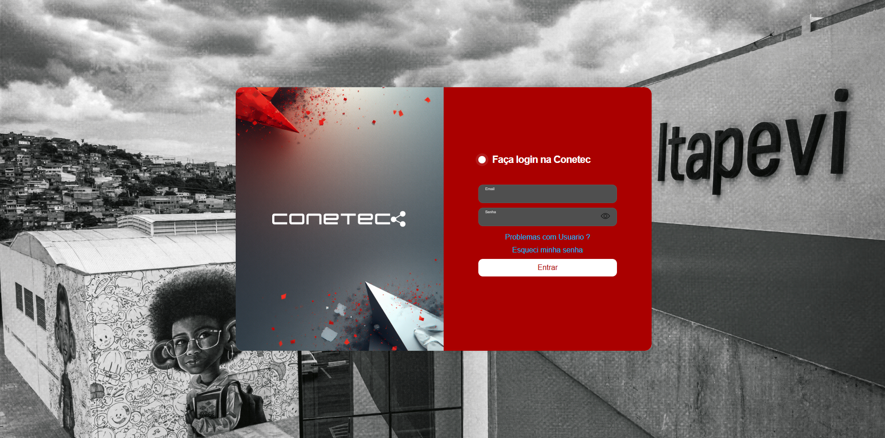
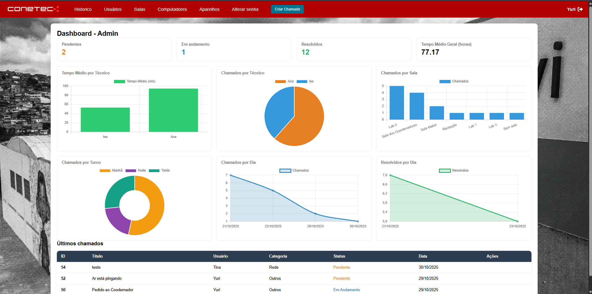
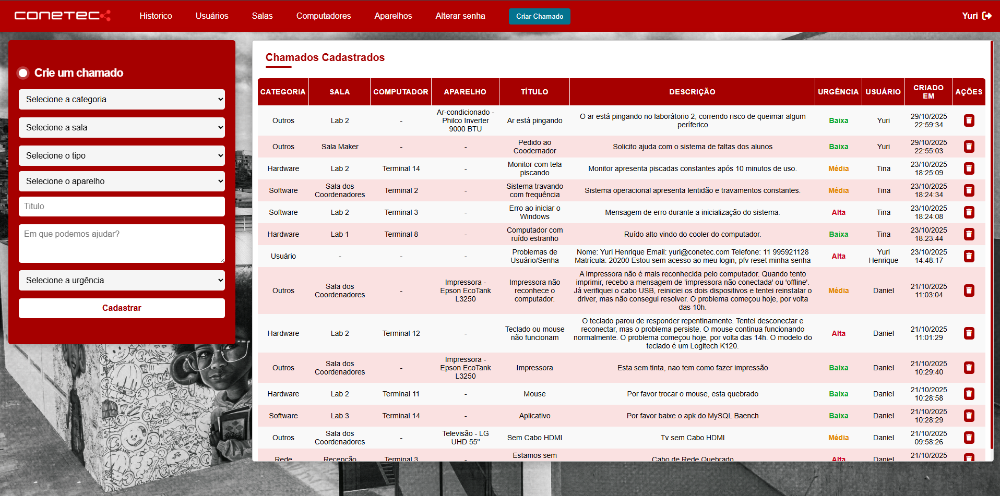
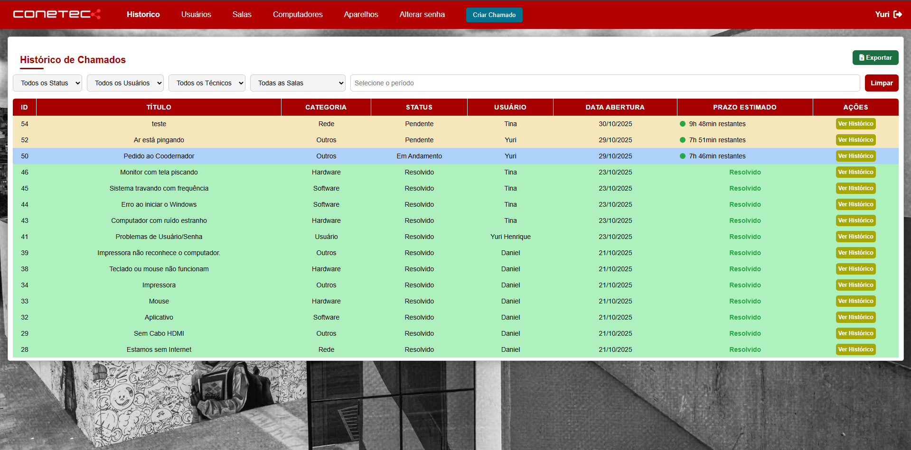

  

<h1 align="center">🧰 Conetec</h1>

  <strong>Sistema de Gerenciamento de Chamados Técnicos</strong> 
  <em>Projeto desenvolvido como parte do TCC da ETEC</em>

---

# 💻 Conetec

---

**Conetec** é um sistema web para **gerenciamento de chamados técnicos**, **controle de equipamentos** e **administração de salas**, desenvolvido para uso interno em instituições de ensino.  
O sistema centraliza a abertura e acompanhamento de chamados, com autenticação segura e painéis personalizados para cada tipo de usuário.

---

## 📚 Sumário

1. [🚀 Tecnologias Utilizadas](#-tecnologias-utilizadas)  
2. [🧩 Funcionalidades Principais](#-funcionalidades-principais)  
3. [👥 Perfis de Usuário](#-perfis-de-usuário)  
4. [🧪 Funcionalidades Concluídas](#-funcionalidades-concluídas)  
5. [🔄 Etapas Restantes](#-etapas-restantes)  
6. [📸 Demonstrações](#-demonstrações)  
7. [👨‍💻 Equipe de Desenvolvimento](#-equipe-de-desenvolvimento)  
8. [📄 Licença](#-licença)  

---

## 🚀 Tecnologias Utilizadas

### 🧠 Backend (Hospedado na Vercel)

### 🎨 Frontend (Hospedado na Vercel)

### 🗄️ Banco de Dados

### 🌐 Infraestrutura

---

---

## 🧩 Funcionalidades Principais

- 📋 Abertura e acompanhamento de **chamados técnicos**
- 🧑‍💼 Painel administrativo com **CRUD completo**
- 📊 **Dashboard com gráficos e estatísticas** (para o administrador)
- 🔒 **Autenticação segura (JWT)** com proteção de rotas
- 💾 Controle e cadastro de **salas, computadores, aparelhos e usuários**
- 🕓 **Histórico de manutenções** e atualizações de status

---

## 👥 Perfis de Usuário

### 👨‍💼 Administrador (Chefe dos Técnicos)
- Acesso total a todas as funcionalidades do sistema  
- **Dashboard com gráficos e estatísticas** (chamados abertos, concluídos, em andamento etc.)  
- CRUD completo de **salas**, **computadores**, **aparelhos** e **usuários**  
- Gerenciamento e atualização de **chamados técnicos**  
- Consulta ao **histórico de manutenções**  

### 🛠️ Técnico
- Acesso aos chamados atribuídos  
- Atualização do **status do chamado** (Pendente, Em andamento, Resolvido)  
- Registro de ações e comentários, exibindo o **histórico do chamado**  

### 👤 Usuário Comum
- Abertura de chamados técnicos  
- Acompanhamento do status do atendimento  
- Consulta do histórico de chamados realizados  

---

## 🧪 Funcionalidades Concluídas
✅ CRUD completo de salas, computadores, aparelhos e usuários  
✅ Sistema de autenticação com JWT e bcrypt  
✅ Painel administrativo com dashboard  
✅ Abertura e gerenciamento de chamados  
✅ Integração entre frontend e backend  

---

## 🔄 Etapas Restantes
- ☁️ Hospedagem do backend e banco de dados na nuvem  
- 🌐 Deploy completo (acesso remoto ao sistema)  
- 📱 Ajustes de layout e responsividade  
- 🧪 Testes finais e (opcional) vídeo de demonstração  

---

## 📸 Demonstrações

| Tela | Descrição |
|------|------------|
|  | Tela de login com autenticação segura |
|  | Painel principal com gráficos e estatísticas do administrador |
|  | Abertura e acompanhamento de chamados |
|  | Histórico de manutenção dos equipamentos |

---

## 👨‍💻 Equipe de Desenvolvimento
- **Yuri Henrique** – Backend, Frontend & Autenticação  

---

## 📄 Licença
Este projeto foi desenvolvido para fins educacionais como parte do **Trabalho de Conclusão de Curso (TCC)** da **ETEC**.
